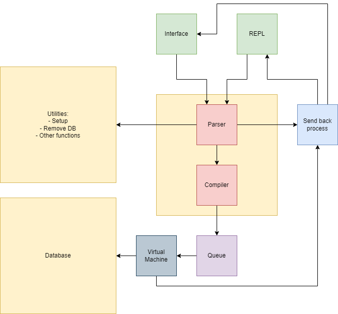

# Main Design

## Design Scope:
This design is meant to provide a highlevel overview of the various components developed. I will first define this components, their priority, and the order in which I plan to implement this. I will then summarize the the document and attempt to define an initial scope for this project.

### Interface and REPL
Scope:  
These will be used to handle outside requests to query the database.This includes receiving the requests through either a port or through the terminal's read buffer. They will take this data and launch a to the parser. There will also be some sort of security check as we wouldn't want just anyone to be able to query the database.

### Parser + Compiler
This will handle taking the query strings, parsing them, and handing them to the executer. The parser will catch syntax errors before reaching the database. The parser will also be able to read utility commands and direct those to separate pieces of code. The parser will send the compiled query to the queue. For utility functions, we will probably just exec one of the functions.

### Queue
This will hold the data for the parsed queries. These queries will wait in line for the database thread to pick the next one up.

### Virtual Machine
This will take in SQL queries, traverse the B Tree, gather the data, adn send it back to the designated endpoint
